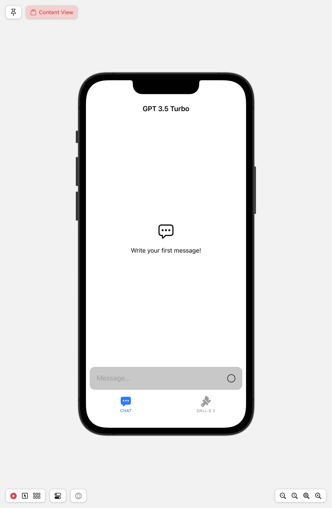
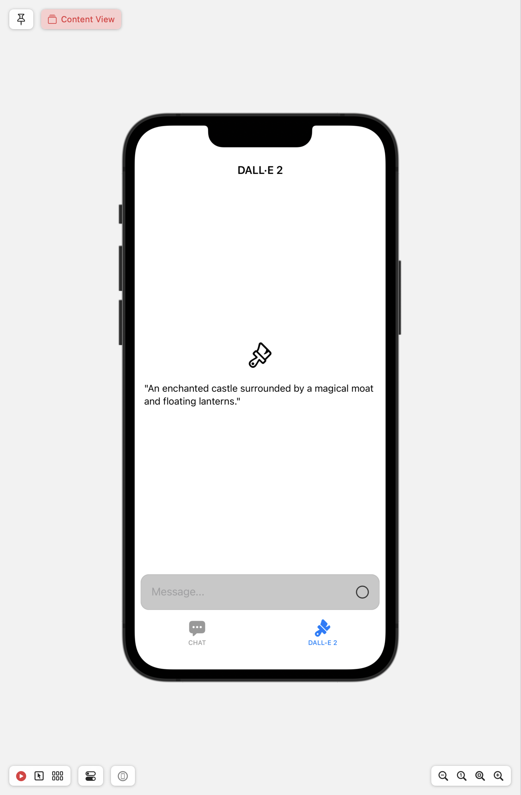

# ChatGPT-DALL-E
Simple app to feature OpenAI's ChatGPT and DALL-E-2 Image generation api using SwiftUI.

You must replace the OpenAI API Key located in the DalleViewModel and GPT3ViewModel file.
If you don't know how, here is the method to getting your API key:
  1. Go to the OpenAI website (https://www.openai.com) and sign in to your account. If you don't have an account, you'll need to create one first.
  2. Once you're signed in, navigate to the "API Keys" section. You can usually find it in the account settings or developer dashboard.
  3. Click on the "Create API Key" or "Generate API Key" button.
  4. Provide a name or description for your API key to help you identify its purpose.
  5. After you've provided the necessary information, click on the "Generate" or "Create" button.
  6. The OpenAI platform will generate an API key for you.
  7. Once the API key is generated, copy it and store it securely. Make sure not to share it with others or expose it publicly.

